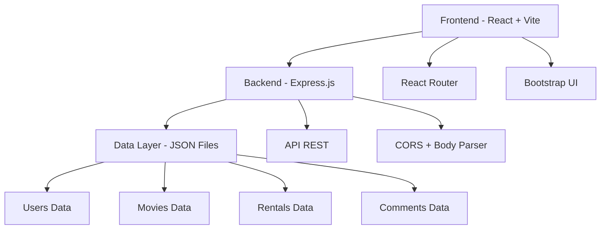

# 🎬 Plataforma de Renta de Películas

<div align="center">
  
  
  
  
</div>

<div align="center">
  <h3>Una plataforma moderna y completa para la gestión y renta de películas</h3>
  <p>Desarrollada con tecnologías web modernas para brindar una experiencia de usuario excepcional</p>
</div>

---

## 📋 Tabla de Contenidos

- [🌟 Características Principales](#-características-principales)
- [🏗️ Arquitectura del Proyecto](#️-arquitectura-del-proyecto)
- [🚀 Tecnologías Utilizadas](#-tecnologías-utilizadas)
- [📁 Estructura del Proyecto](#-estructura-del-proyecto)
- [⚙️ Instalación y Configuración](#️-instalación-y-configuración)
- [🎯 Funcionalidades](#-funcionalidades)
- [👥 Tipos de Usuario](#-tipos-de-usuario)
- [🛠️ Scripts Disponibles](#️-scripts-disponibles)
- [📡 API Endpoints](#-api-endpoints)


---

## 🌟 Características Principales

### ✨ **Gestión Completa de Usuarios**
- 🔐 **Sistema de autenticación** seguro con registro e inicio de sesión
- 👤 **Perfiles personalizables** con información detallada del usuario
- 🔒 **Roles de usuario** (Cliente y Administrador)

### 🎭 **Catálogo de Películas**
- 📚 **Extenso catálogo** con información detallada de cada película
- 🔍 **Búsqueda avanzada** por título, género, director, año
- ⭐ **Sistema de comentarios** y valoraciones
- 🖼️ **Interfaz visual atractiva** con imágenes de alta calidad

### 💰 **Sistema de Renta**
- 🛒 **Proceso de renta** intuitivo y rápido
- 📊 **Historial de rentas** detallado para cada usuario
- ⏰ **Gestión de fechas** de renta y devolución
- 💳 **Cálculo automático** de precios

### 🛡️ **Panel Administrativo**
- ➕ **Gestión de películas** (agregar, editar, eliminar)
- 👥 **Administración de usuarios** con control total
- 📈 **Dashboard informativo** con estadísticas
- 🔧 **Herramientas de mantenimiento** del sistema

---

## 🏗️ Arquitectura del Proyecto



---

## 🚀 Tecnologías Utilizadas

### 🎨 **Frontend**
| Tecnología | Versión | Propósito |
|------------|---------|-----------|
| **React** | 18.3.1 | Biblioteca principal para UI |
| **Vite** | 5.3.1 | Herramienta de construcción y desarrollo |
| **React Router DOM** | 6.23.1 | Enrutamiento del lado del cliente |
| **Bootstrap** | 5.3.3 | Framework CSS para diseño responsivo |
| **React Bootstrap** | 2.10.3 | Componentes de Bootstrap para React |
| **JS Cookie** | 3.0.5 | Gestión de cookies |

### 🔧 **Backend**
| Tecnología | Versión | Propósito |
|------------|---------|-----------|
| **Node.js** | - | Entorno de ejecución |
| **Express.js** | 4.19.2 | Framework web para Node.js |
| **CORS** | 2.8.5 | Manejo de políticas de origen cruzado |
| **Body Parser** | 1.20.2 | Análisis de cuerpos de solicitud |
| **Cookie Parser** | 1.4.6 | Análisis de cookies |

### 📊 **Almacenamiento de Datos**
- **JSON Files** - Sistema de archivos para persistencia de datos
- **File System Operations** - Lectura y escritura de archivos

---

## 📁 Estructura del Proyecto

```
PAGINA_RENTAPELICULAS/
├── 📄 README.md
└── RENTA_PELICULAS/
    ├── 🔧 Backend/
    │   ├── 📄 index.js                 # Punto de entrada del servidor
    │   ├── 📦 package.json             # Dependencias del backend
    │   ├── 🎮 controllers/             # Lógica de negocio
    │   │   ├── authController.js       # Autenticación
    │   │   ├── commentsController.js   # Gestión de comentarios
    │   │   ├── moviesController.js     # Gestión de películas
    │   │   ├── rentalsController.js    # Gestión de rentas
    │   │   └── usersController.js      # Gestión de usuarios
    │   ├── 📊 data/                    # Capa de datos
    │   │   ├── comments.js & Comments.json
    │   │   ├── movies.js & Movies.json
    │   │   ├── rentals.js & Rentals.json
    │   │   └── users.js & Users.json
    │   ├── 🛣️ routes/                  # Definición de rutas
    │   │   ├── authRoutes.js
    │   │   ├── commentsRoutes.js
    │   │   ├── moviesRoutes.js
    │   │   ├── rentalsRoutes.js
    │   │   └── usersRoutes.js
    │   └── 🔨 utils/
    │       └── validation.js           # Utilidades de validación
    └── 🎨 Frontend/
        ├── 📄 index.html               # Punto de entrada HTML
        ├── 📦 package.json             # Dependencias del frontend
        ├── ⚙️ vite.config.js           # Configuración de Vite
        ├── 🌐 public/                  # Archivos públicos
        └── 📁 src/
            ├── 📄 App.jsx              # Componente principal
            ├── 📄 main.jsx             # Punto de entrada React
            ├── 🎨 App.css & index.css  # Estilos globales
            ├── 🖼️ assets/              # Recursos estáticos
            ├── 🧩 components/          # Componentes reutilizables
            ├── 🔄 contexts/            # Contextos de React
            └── 📄 pages/               # Páginas de la aplicación
```

---

## ⚙️ Instalación y Configuración

### 📋 **Prerrequisitos**
- Node.js (versión 16 o superior)
- npm o yarn
- Git

### 🚀 **Instalación Paso a Paso**

#### 1️⃣ **Clonar el Repositorio**
```bash
git clone <url-del-repositorio>
cd PAGINA_RENTAPELICULAS
```

#### 2️⃣ **Configurar el Backend**
```bash
cd RENTA_PELICULAS/Backend
npm install
npm start
```
> El servidor backend se ejecutará en `http://localhost:5000`

#### 3️⃣ **Configurar el Frontend**
```bash
# En una nueva terminal
cd RENTA_PELICULAS/frontend
npm install
npm run dev
```
> La aplicación frontend se ejecutará en `http://localhost:5173`

### 🔧 **Configuración de Variables**
- **Puerto Backend**: 5000 (configurable en `Backend/index.js`)
- **Puerto Frontend**: 5173 (configurado por Vite)
- **CORS Origin**: `http://localhost:5173`

---

## 🎯 Funcionalidades

### 🔐 **Sistema de Autenticación**
- ✅ Registro de nuevos usuarios con validación de datos
- ✅ Inicio de sesión seguro
- ✅ Gestión de sesiones con cookies
- ✅ Protección de rutas según roles

### 🎬 **Gestión de Películas**
- ✅ Visualización del catálogo completo
- ✅ Detalles completos de cada película
- ✅ Búsqueda y filtrado avanzado
- ✅ Sistema de comentarios y valoraciones

### 💼 **Sistema de Rentas**
- ✅ Proceso de renta intuitivo
- ✅ Cálculo automático de precios
- ✅ Historial de rentas del usuario
- ✅ Estado de rentas activas

### 👨‍💼 **Panel Administrativo**
- ✅ CRUD completo de películas
- ✅ Gestión de usuarios registrados
- ✅ Administración de rentas
- ✅ Moderación de comentarios

---

## 👥 Tipos de Usuario

### 🛡️ **Administrador**
**Credenciales por defecto:**
- 📧 Email: `admin@email.com`
- 🔒 Password: `Admin123`

**Privilegios:**
- ➕ Agregar nuevas películas al catálogo
- ✏️ Editar información de películas existentes
- 🗑️ Eliminar películas del sistema
- 👥 Gestionar usuarios registrados
- 📊 Acceso a estadísticas del sistema

### 👤 **Cliente**
**Funcionalidades:**
- 🔍 Explorar catálogo de películas
- 🛒 Rentar películas disponibles
- 💬 Dejar comentarios y valoraciones
- 👨‍💼 Editar perfil personal
- 📋 Ver historial de rentas

---

## 🛠️ Scripts Disponibles

### 🔧 **Backend**
```bash
npm start          # Iniciar servidor en producción
npm test           # Ejecutar pruebas (por configurar)
```

### 🎨 **Frontend**
```bash
npm run dev        # Servidor de desarrollo con hot reload
npm run build      # Construcción para producción
npm run preview    # Vista previa de la construcción
npm run lint       # Análisis de código con ESLint
```

---

## 📡 API Endpoints

### 🔐 **Autenticación**
```http
POST   /api/auth/register    # Registro de usuario
POST   /api/auth/login       # Inicio de sesión
POST   /api/auth/logout      # Cerrar sesión
```

### 👥 **Usuarios**
```http
GET    /api/users            # Obtener todos los usuarios
GET    /api/users/:id        # Obtener usuario específico
PUT    /api/users/:id        # Actualizar usuario
DELETE /api/users/:id        # Eliminar usuario
```

### 🎬 **Películas**
```http
GET    /api/movies           # Obtener catálogo completo
GET    /api/movies/:id       # Obtener película específica
POST   /api/movies           # Agregar nueva película (Admin)
PUT    /api/movies/:id       # Actualizar película (Admin)
DELETE /api/movies/:id       # Eliminar película (Admin)
```

### 🛒 **Rentas**
```http
GET    /api/rentals          # Obtener rentas
POST   /api/rentals          # Crear nueva renta
PUT    /api/rentals/:id      # Actualizar renta
DELETE /api/rentals/:id      # Cancelar renta
```

### 💬 **Comentarios**
```http
GET    /api/comments         # Obtener comentarios
POST   /api/comments         # Agregar comentario
PUT    /api/comments/:id     # Editar comentario
DELETE /api/comments/:id     # Eliminar comentario
```

---

<div align="center">
  <h3>⭐ Si te gusta este proyecto, ¡dale una estrella! ⭐</h3>
  <p>Desarrollado con ❤️ usando tecnologías modernas</p>
  
  
  
</div>